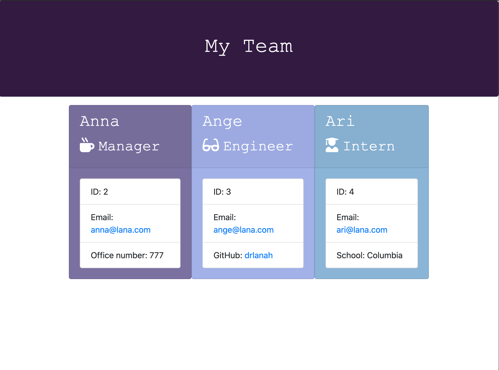

# README.md

### Table of Contents

1. [Description]
2. [Installation]
3. [Usage]
4. [License]
5. [Contributing]
6. [Tests]
7. [Contact]

### Description

- Software engineering team generator command line application

### Installation

- Access terminal, input “node app.js”, answer user prompts

### Usage

- A series of prompts with questions will appear in the terminal.
- The user will be asked for their respective role.
- If users selects "Engineer", prompts will appear to enter name, ID, email, and github.
- If users selects "Manager", prompts will appear to enter name, ID, email, and office number.
- If users selects "Intern", prompts will appear to enter name, ID, email, and school.
- After adding contact info for the selected role, user is asked "Would you like to add another Team member?
- If "Y" is selected, user will be prompted to enter another team member. If no, HTML file will be generated in "Output" folder.

### License

- MIT

### Contributing

- Lana

### Tests

- Open "team.html" file created in "output" folder after answering questions appropriately

### Contact

- Github: https://github.com/drlanah
- Email: sh3913@columbia.edu

### Preview

